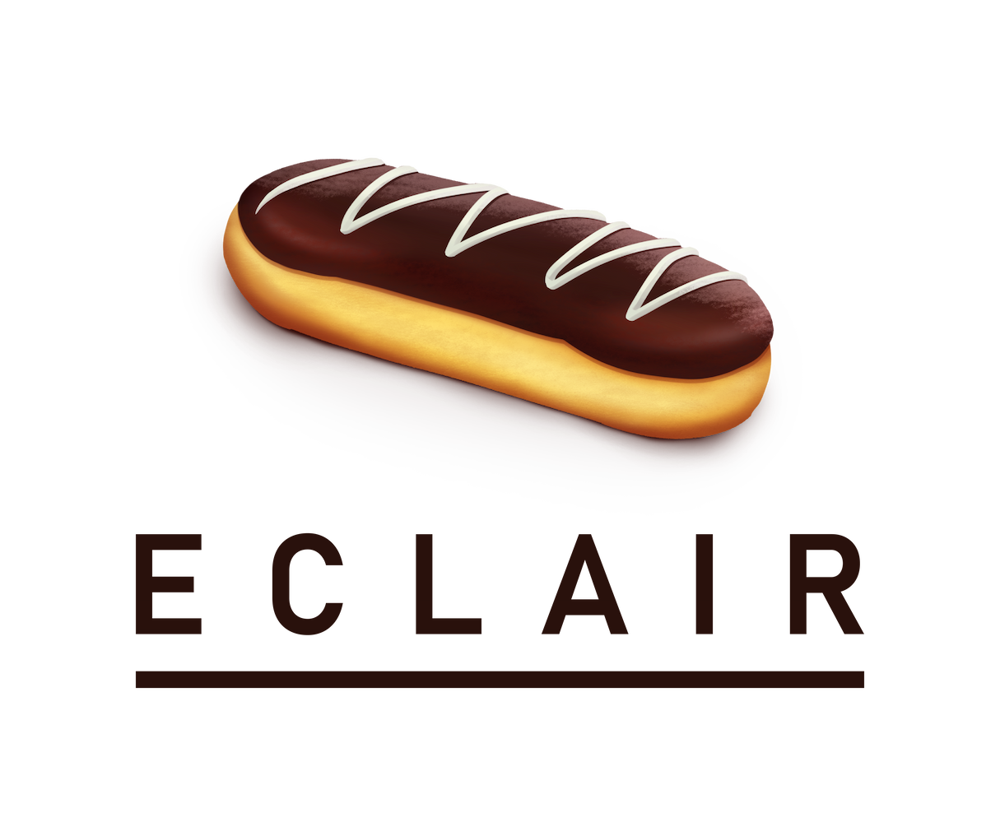

<picture>
  <source media="(prefers-color-scheme: dark)" srcset="./logo_dark.png"/>
  
</picture>

_An experimental and minimal Datalog implementation that compiles down to LLVM._

## Features

Eclair is a minimal Datalog (for now). It supports the following features:

- Facts containing literals
- Rules consisting of one or more clauses.
- Rules can be non-recursive, recursive or mutually recursive.

It's still early stage software, not ready for real use. Right now it compiles
to LLVM but be aware there might still be bugs. Some edge cases might not be
handled yet.

## Motivating example

Let's say we want to find out which points are reachable in a graph. We can
determine which points are reachable using the following two logical rules:

1. One point is reachable from another point, iff there is a direct edge between
   those two points.
2. One point is reachable from another point, iff there is a third point 'z' such
   that there is a direct edge between 'x' and 'z', and between 'z' and 'y'.

The Eclair code below can be used to calculate the solution:

```eclair
@def edge(u32, u32).
@def reachable(u32, u32).

reachable(x, y) :-
  edge(x, y).

reachable(x, z) :-
  edge(x, y),
  reachable(y, z).
```

The above code can be compiled to LLVM using the Docker image provided by this repo:

```bash
$ git clone git@github.com:luc-tielen/eclair-lang.git
$ cd eclair-lang
$ docker build . -t eclair
# The next line assumes the eclair code is saved as "example.dl" in the current directory
$ docker run -v $PWD:/code --rm -it eclair:latest compile /code/example.dl
# NOTE: output can be redirected to a file using standard shell functionality: docker run ... > example.ll
```

This will emit the generated LLVM IR to the stdout of the terminal. If we save
this generated LLVM IR to a file (e.g. `example.ll`), we can link it with the
following C code that calls into Eclair, using the following command:
`clang -o program main.c example.ll`.

```c
// Save this file as "main.c".
#include <stdio.h>
#include <stdlib.h>
#include <stdbool.h>
#include <stdint.h>


struct program;

extern struct program* eclair_program_init();
extern void eclair_program_destroy(struct program*);
extern void eclair_program_run(struct program*);
extern void eclair_add_facts(struct program*, uint16_t fact_type, uint32_t* data, size_t fact_count);
extern void eclair_add_fact(struct program*, uint16_t fact_type, uint32_t* data);
extern uint32_t* eclair_get_facts(struct program*, uint16_t fact_type);
extern void eclair_free_buffer(uint32_t* data);

int main(int argc, char** argv)
{
    struct program* prog = eclair_program_init();

    // edge(1,2), edge(2,3)
    uint32_t data[] = {
        1, 2,
        2, 3
    };
    eclair_add_facts(prog, 0, data, 2);

    eclair_program_run(prog);

    // NOTE: normally you call btree_size here to figure out the size, but I know there are only 3 facts
    uint32_t* data_out = eclair_get_facts(prog, 1);
    printf("REACHABLE: (%d, %d)\n", data_out[0], data_out[1]);  // (1,2)
    printf("REACHABLE: (%d, %d)\n", data_out[2], data_out[3]);  // (2,3)
    printf("REACHABLE: (%d, %d)\n", data_out[4], data_out[5]);  // (1,3)

    eclair_free_buffer(data_out);

    eclair_program_destroy(prog);
    return 0;
}
```

If you run the resulting program, this should print the reachable node pairs
`(1,2)`, `(2,3)` and `(1,3)` to the screen!

## Roadmap

- [x] LSP support
- [x] Allow setting options on relations for performance finetuning
- [x] Comparison operators, != operator
- [ ] Support arithmetic operators
- [ ] Generic, extensible primops
- [ ] Release 0.2.0
- [ ] Support negation
- [ ] Optimizations on the AST / RA / LLVM level
- [ ] Support other underlying data structures than btree
- [ ] Syntactic sugar (disjunctions in rule bodies, multiple rule heads, ...)
- [ ] Support Datalog programs spanning multiple files
- [ ] ...

This roadmap is not set in stone, but it gives an idea on the direction of the
project. :smile:

## Contributing to Eclair

Contributions are welcome! Take a look at the
[getting started guide](./docs/getting_started.md) on how to set up your machine
to build, run and test the project. Once setup, the Makefile contains the most
commonly used commands needed during development.

You can also use the `Dockerfile` in this repository if you want to experiment
with Eclair without installing the toolchain yourself. You can do that as
follows:

```bash
$ docker build -f Dockerfile . -t eclair
$ touch test.eclair  # Here you can put your Eclair code
$ docker run -v $PWD:/code --rm -it eclair eclair compile /code/test.eclair
```

## Documentation

Take a look at our [docs folder](./docs/) for more information about Eclair.

## Why the name?

Eclair is inspired by [Soufflé](https://souffle-lang.github.io/), a high
performance Datalog that compiles to C++. Because of the similarities, I chose a
different kind of food that I like. I mean, an eclair contains _both_ chocolate and
pudding, what's not to like!?

Logo art by [Bruno Monts](https://www.instagram.com/bruno_monts/),
with special thanks to the [Fission](https://fission.codes) team.
Please contact Luc Tielen before using the logo for anything.
